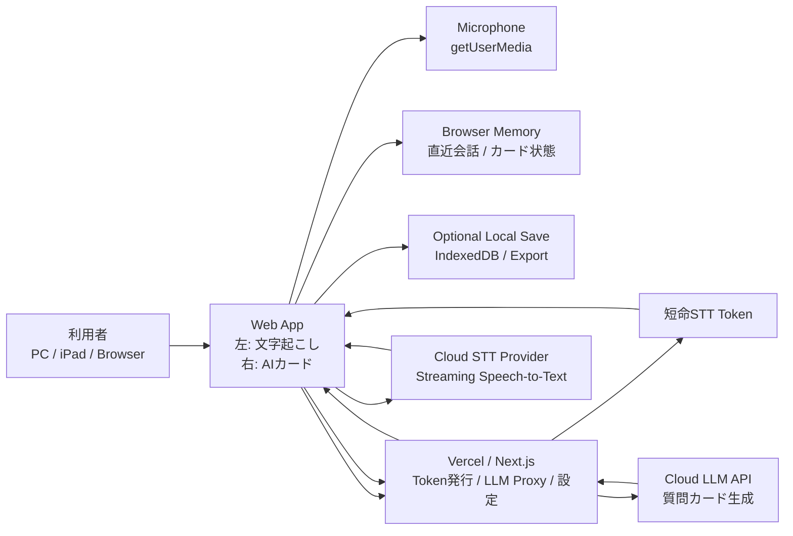
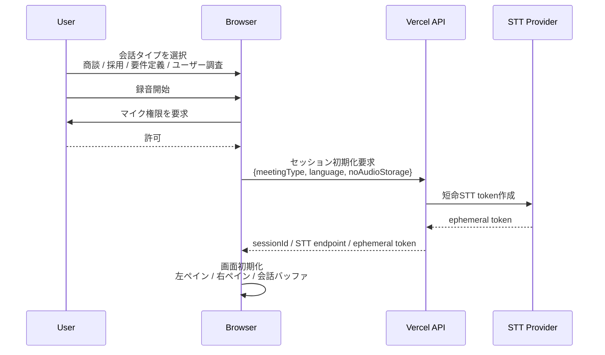
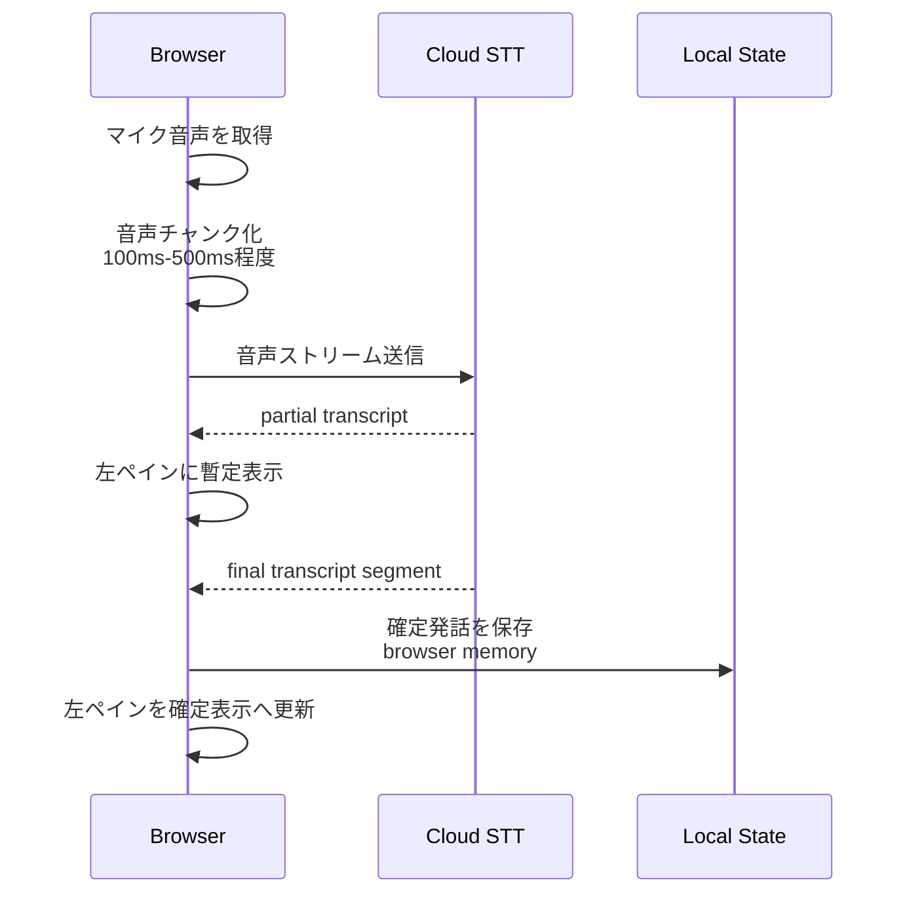
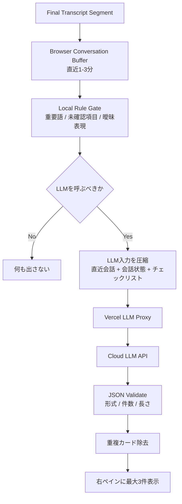
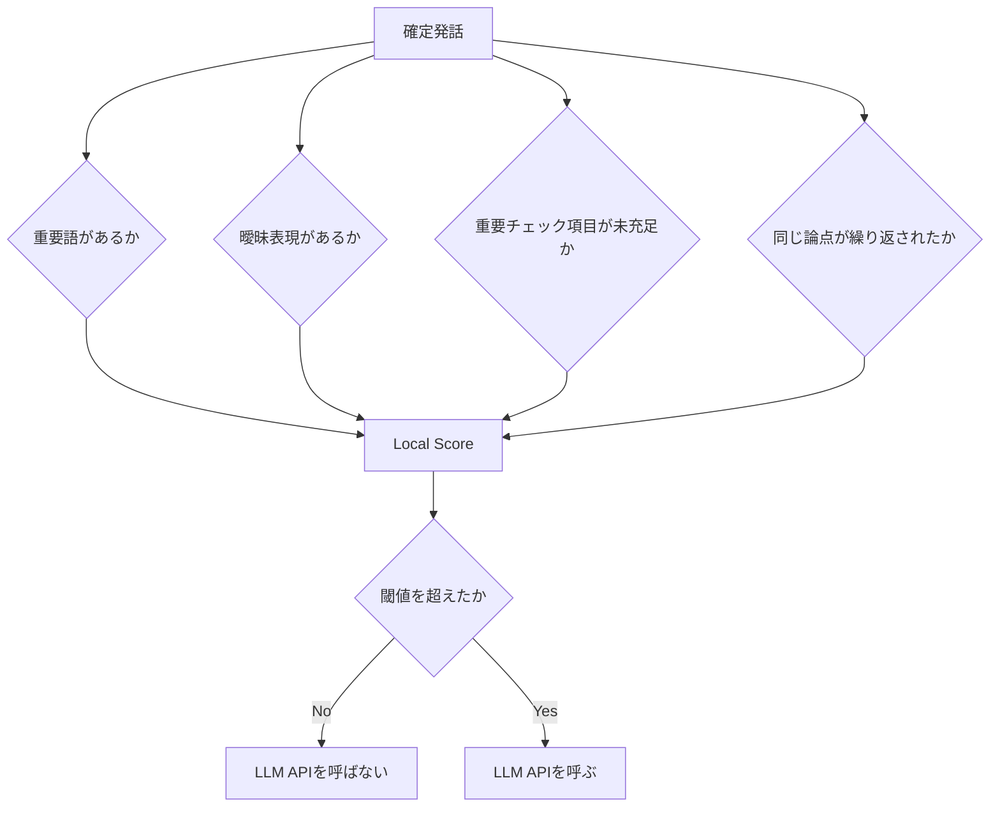
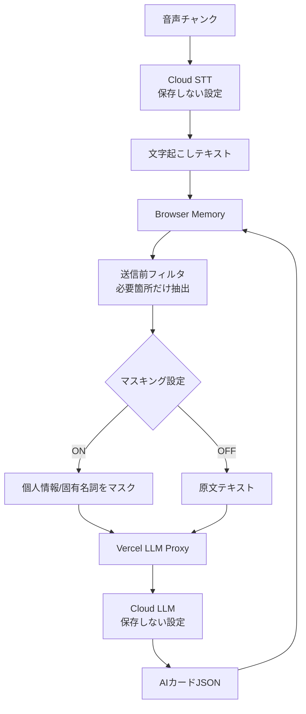
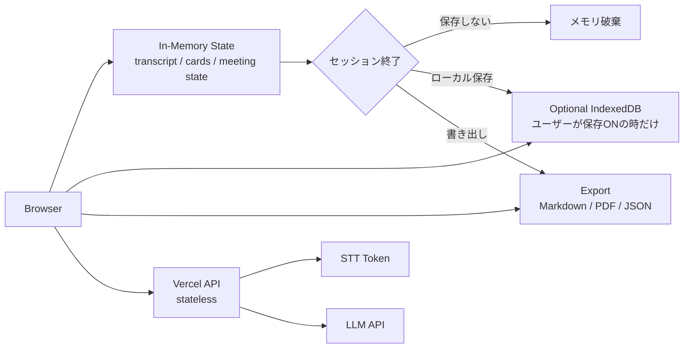
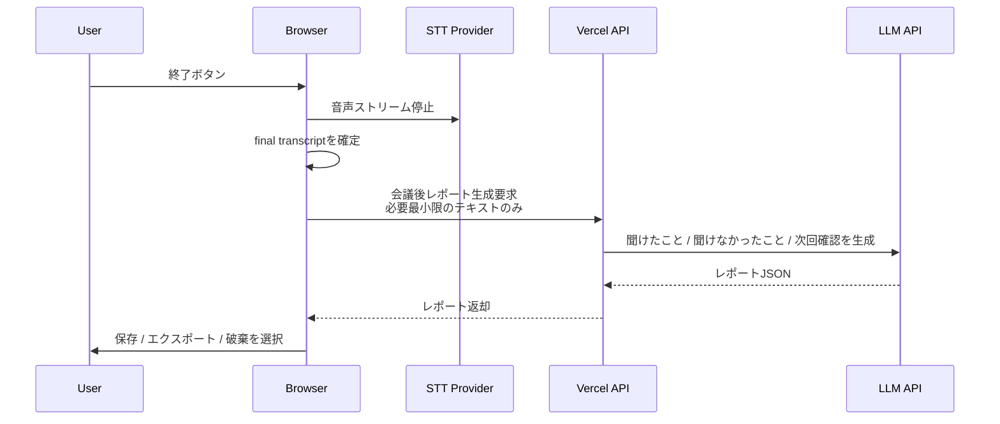
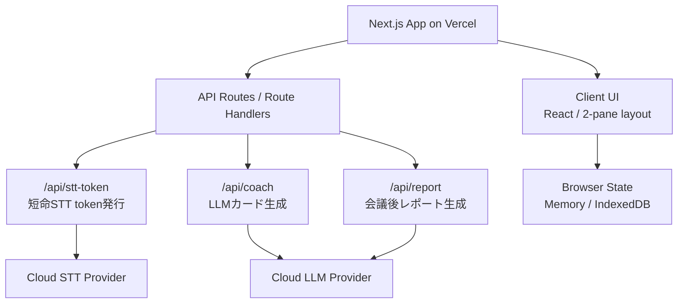
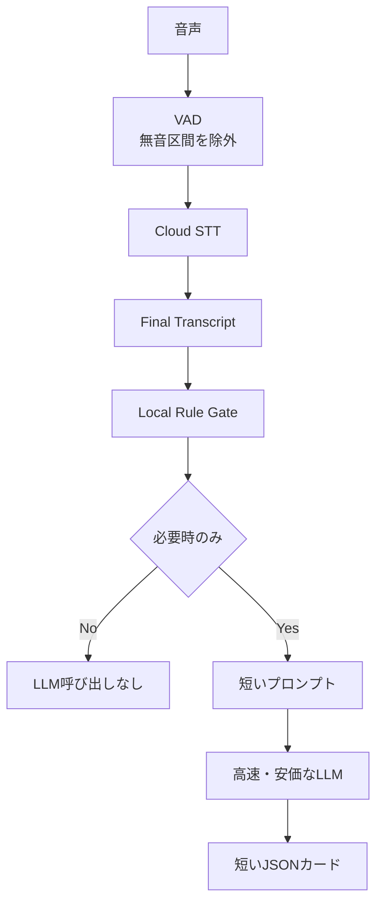

# Cloud STT + Cloud AI System Flows

## 0. 前提

この構成では、音声認識とAIカード生成にクラウドサービスを使う。

- STT: クラウド音声認識APIを使用
- AI: クラウドLLM APIを使用
- DB: MVPでは持たない
- 音声: 自社クラウドには保存しない
- 文字起こし: 基本はブラウザ内メモリに保持
- ローカル保存: 必要な場合のみユーザー端末のIndexedDB / ファイル保存
- サーバー: Vercel / Next.jsを想定

重要な整理:

```text
音声をクラウドSTTへ送る
  = クラウド処理は発生する

音声を自社クラウドに保存しない
  = 音声ファイルをDB/S3等に残さない
```

## 1. 全体システムフロー



推奨は、音声ストリームをVercelで中継し続けない構成。Vercelは短命トークンを発行し、ブラウザがSTTプロバイダへ直接接続する。これにより、Vercel Functionsの長時間接続・帯域コスト・タイムアウトリスクを避けやすい。

## 2. セッション開始フロー



`sessionId` はDBに保存しない一時IDでよい。ブラウザ内の状態管理、LLM呼び出しの相関ID、画面表示に使う。

## 3. 音声ストリーミング + 文字起こしフロー



`partial transcript` は画面表示用。AIカード生成には原則 `final transcript` を使う。

理由:

- 暫定文字起こしは誤変換が多い
- LLM呼び出し回数が増えやすい
- 無駄なカード生成が起きやすい

## 4. AIカード生成フロー



LLMには会話全文を毎回送らない。送るのは以下に絞る。

```text
直近1-3分の確定文字起こし
現在の会話タイプ
すでに聞けた項目
未確認の重要項目
既に表示したカードID
```

## 5. LLM呼び出し条件



例:

```text
LLMを呼ぶ:
- 予算、決裁者、期限、責任者、対象範囲が出た
- 「一応」「たぶん」「未定」「あとで確認」が出た
- 課題は出たが、影響範囲や数値がない
- 会話タイプ別の必須項目が埋まっていない

LLMを呼ばない:
- 相槌
- 雑談
- 既に処理した論点
- 短すぎる発話
- partial transcriptのみ
```

## 6. セキュア処理フロー



確認すべきセキュリティ項目:

- STTプロバイダ側で音声を学習利用しない設定
- STTプロバイダ側のログ保持期間
- LLMプロバイダ側で入力を学習利用しない設定
- LLMプロバイダ側のログ保持期間
- 自社側で音声を保存しない実装
- Vercelログに本文・音声・API応答を出さない実装
- ブラウザ内保存の明示

## 7. DBなしMVPフロー



DBなしで持てるもの:

- 現在の文字起こし
- 現在のAIカード
- ユーザーのカード操作
- 会議後の簡易レポート
- ローカル保存された過去セッション

DBなしで難しくなるもの:

- 複数端末同期
- チーム管理
- 管理者監査
- 課金状態管理
- 組織別設定
- 過去会議のクラウド検索
- サポート調査

## 8. 会議終了フロー



会議後レポートもDBに保存しない。ユーザーが明示的にローカル保存またはエクスポートする。

## 9. Vercel構成



必要なVercel環境変数:

```text
STT_API_KEY
LLM_API_KEY
STT_REGION
LLM_MODEL_REALTIME
LLM_MODEL_REPORT
RETENTION_MODE=no_store
```

Vercel APIでやること:

- APIキーをブラウザに直接出さない
- STT用の短命トークンを発行する
- LLM呼び出しをプロキシする
- 入出力JSONを検証する
- 本文をログに出さない
- レート制限をかける

Vercel APIでやらない方がよいこと:

- 長時間音声ストリームの中継
- 音声ファイル保存
- 文字起こし全文の永続保存
- 会議本文のログ出力

## 10. コスト削減フロー



コスト削減の優先順位:

1. 無音区間を送らない
2. partial transcriptでLLMを呼ばない
3. LLM呼び出しを15-30秒単位に制限
4. 重要語がない時はLLMを呼ばない
5. 直近会話だけ送る
6. 出力をJSON最大3件に絞る
7. 会議後レポートだけ高精度モデルにする

## 11. 推奨MVP構成

```text
Frontend:
  Next.js / React on Vercel

Realtime STT:
  Cloud STT Provider
  Browser direct streaming with ephemeral token

AI Cards:
  Vercel API Route
  Cloud LLM API
  JSON schema validation

Storage:
  No server DB
  Browser memory by default
  Optional IndexedDB / file export

Security:
  No audio storage
  No transcript logging
  Provider no-training / low-retention setting
```

最初のプロダクトメッセージ:

```text
音声ファイルを自社クラウドに保存しない
会話データをDBに残さない
会議中だけ、聞くべき質問を表示する
```

