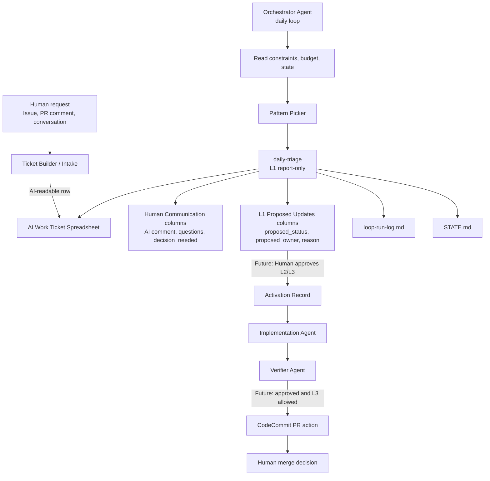

# Loop Engineering Member Guide

この文書は、Realtime Question Coach の AI 駆動開発と Loop 処理を知らないプロジェクトメンバーが、全体像を短時間で理解するための入口である。

詳細な実行ルールは各専用ドキュメントを正とする。この文書は、運用の目的、登場人物、チケットの流れ、Spreadsheet の読み方、人間が判断すべきポイントを説明する。

## What This Is

Realtime Question Coach では、AI に直接「この Issue を読んで実装して」と渡さない。

人間の依頼、Issue、PR コメント、会話メモなどを、まず AI が読める `AI Work Ticket` に変換する。その後、Orchestrator Agent が毎日 Loop を回し、各 Ticket をどう扱うべきかを判断する。

現在の基本運用は次の通り。

| Item | Current policy |
| --- | --- |
| 実行単位 | AI Work Ticket |
| Ticket 管理 | Google Sheets 1シート |
| 通常 Loop | `daily-triage` |
| 実行主体 | Orchestrator Agent |
| 通常自律度 | L1 report-only |
| L1 でやること | 棚卸し、構造検査、差し戻し、human gate 判定、次 action 提案 |
| L1 でやらないこと | 実装、branch 作成、PR 作成、merge、canonical status 変更 |
| L2 / L3 | 未解放。将来許可できるように契約、列、agent 定義を準備している段階 |

## Why We Need This

Realtime Question Coach は単純な CRUD アプリではない。

{{RESERVATION_DOMAIN}}、{{ESTIMATE_DOMAIN}}、{{BILLING_DOMAIN}}、{{RECEIPT_DOMAIN}}、PDF、{{DAILY_LOCK_DOMAIN}}、KPI、{{ACCOUNTING_SYSTEM}}、外部 API、DB、script、jQuery 画面挙動が絡む。AI がチケットの不足や危険領域を見落として実装へ進むと、業務上の事故につながる。

Loop Engineering の目的は、AI の作業を止めることではない。AI が動く前に、次を明確にすることである。

- 何を解決するのか。
- どこまでやるのか。
- 何をやらないのか。
- 人間判断が必要か。
- 仕様精緻化が必要か。
- どの agent に任せるべきか。
- どの検証を通すべきか。
- 将来の実装候補にする場合、どの自律度候補が妥当か。

## Big Picture

重要なのは、現時点で解放済みなのは L1 までであること。L1 の時点では AI は提案までしか行わない。L2 / L3 は今後の運用状況を見ながら、問題がなければ段階的に許可していくための設計済み領域である。

## Main Terms

| Term | Meaning |
| --- | --- |
| Human-origin input | 人間が書いた依頼、Issue、PR コメント、会話メモなど。AI Work Ticket ではない |
| Ticket Builder / Intake | raw input を AI が読める AI Work Ticket に変換する前段 |
| AI Work Ticket | AI が読む実行契約。Spreadsheet の 1 行 |
| Orchestrator Agent | Loop を開始し、どの Pattern を使うか、どこへ渡すかを判断する agent |
| Pattern Picker | `daily-triage`, `ci-sweeper` など、どの Loop Pattern を起動するかを決める文書 |
| daily-triage | AI Work Ticket を棚卸しし、構造検査、human gate 判定、次 action 提案を行う Loop Pattern |
| agent | 実装、検証、レビュー、計画などの役割を持つ実行主体 |
| human gate | AI だけで進めず、人間判断、承認、補足が必要な条件 |
| deny list | AI / Loop が自律実行してはいけない操作や領域 |
| Activation Record | 将来 L2 / L3 を許可する場合に、人間が Ticket ごとに与える実行承認 |

## What Daily Triage Does

`daily-triage` は agent ではない。Loop Pattern である。

Orchestrator Agent が `daily-triage` を起動し、AI Work Ticket Spreadsheet を読み、各 Ticket について次を判断する。

1. AI Work Ticket として構造が足りているか。
2. raw human request が混ざっていないか。
3. 仕様精緻化が必要か。
4. human gate が必要か。
5. deny list に該当しないか。
6. 実装候補として扱えるか。
7. どの agent に渡すべきか。
8. 人間に何を確認すべきか。

L1 の `daily-triage` は、Spreadsheet の `status` を直接変更しない。代わりに `proposed_status` と AI comment を書く。

## Spreadsheet

AI Work Ticket の正本一覧は Google Sheets で管理する。

[AI Work Ticket Spreadsheet](https://docs.google.com/spreadsheets/d/1y7UEjCTejSJXgLWmvA0SEKOHurl8C5QvtfxMf87ruqc/edit)

1 行目は列名、2 行目は各列の目的である。3 行目以降が Ticket である。

### Important Sections

| Section | Purpose |
| --- | --- |
| Identity | Ticket ID、title、status、priority、owner |
| Source | 元情報の種類、URL、要約、証跡 |
| Understanding | 概要、背景、問題、現状、期待状態、対象ユーザー |
| Scope | 対応範囲、対象外、影響領域 |
| Detailed Requirements | 画面、機能、データ、バリデーション、権限、実装注意 |
| Agent Alignment | 後続 agent が認識を合わせるための意図、成功境界、非目標 |
| Risk And Constraints | risk、human gate、deny list、禁止操作 |
| Verification | 完了条件、必須 check、テスト観点 |
| Triage And Execution | 作業分類、Kiro 要否、実装 agent、自律度 |
| Human Communication | AI から人間へのコメント |
| L1 Proposed Updates | L1 が提案する status、owner、理由 |
| L2 / L3 Execution | 将来 L2 / L3 を解放する場合に使う実装、branch、PR、verifier 証跡 |

## Where Humans Should Look

人間がまず見るべき列は、次である。

| Column | Meaning |
| --- | --- |
| `ai_comment_summary` | AI が人間へ伝える本文 |
| `decision_needed` | 人間に判断してほしいこと |
| `questions_for_human` | 人間への質問 |
| `default_assumption` | 回答がない場合の扱い |
| `reply_format` | 期待する回答形式 |
| `proposed_status` | L1 が提案する次 status |
| `proposed_update_reason` | なぜその status を提案したか |
| `last_loop_run_id` | どの Loop run の結果か |

L1 が書く `proposed_status` は正式 status ではない。現時点で正式な `status` を変えるのは人間の判断である。L2 以上による status 更新は、将来その自律度を解放した場合だけ対象になる。

## Statuses

よく見る status は次の通り。

| Status | Meaning | Human action |
| --- | --- | --- |
| `ready_for_triage` | daily-triage が確認できる状態 | 通常は待つ |
| `ticket_builder_required` | AI Work Ticket として構造不足 | Ticket Builder / Intake で再構造化する |
| `needs_human_management` | 人間の判断、補足、優先度管理が必要 | 判断内容を回答する |
| `human_gate_pending` | human gate 承認待ち | 承認するか、止めるか、条件を返す |
| `blocked_by_constraints` | deny list や制約で実行不可 | AI に実行させず、人間管理に戻す |
| `ready_for_kiro` | 仕様精緻化に進める候補 | Kiro / spec 作成を承認するか判断する |
| `ready_for_implementation` | 実装に進める候補 | 現時点では人間が確認する。将来 L2 / L3 解放時は実行許可候補になる |
| `pending` | 待ち状態 | 次回確認条件を明確にする |
| `no_action_required` | Loop 対応不要 | 問題なければ close / done の判断へ |
| `done` | 処理完了 | 証跡を確認する |

## L0 / L1 / L2 / L3

| Level | Current release status | Intended behavior after future approval | Always not allowed |
| --- | --- | --- | --- |
| L0 | 利用可能 | 読む、要約、質問作成 | ファイル更新、Spreadsheet 更新、実装 |
| L1 | 現在解放済み | report-only。Human Communication / Proposed columns、STATE、run-log 更新 | code 変更、branch 作成、PR 作成、canonical status 変更 |
| L2 | 未解放 | Activation Record 範囲で branch 作成、実装、test、verifier、PR package | PR 作成 command、merge、deploy、未承認 human gate 作業 |
| L3 | 未解放 | L2 に加えて、明示許可された CodeCommit PR 作成や reviewer comment | 自動 merge、人間承認なしの ready 化、release、deploy |

現時点で実運用として解放しているのは L1 までである。L2 / L3 は、今後 L1 運用を見ながら問題がなければ許可できるように、必要な契約、列、agent、PR 方針を先に定義している段階である。

## Human Gate

human gate は、AI が進められそうに見えても、人間の判断が必要な領域である。

Realtime Question Coach では次の領域が特に重要である。

- {{RESERVATION_DOMAIN}}、{{ROOM_DOMAIN}}、{{EVENT_DOMAIN}}、{{CANCEL_DOMAIN}}。
- {{ESTIMATE_DOMAIN}}、{{BILLING_DOMAIN}}、{{SETTLEMENT_DOMAIN}}、{{RECEIPT_DOMAIN}}、{{MONEY_DOMAIN}}計算、{{TAX_DOMAIN}}、丸め。
- PDF / {{REPORT_DOCUMENT_DOMAIN}}、{{PDF_TEMPLATE_ENGINE}}、法務・{{ACCOUNTING_DOMAIN}}上の出力。
- {{DAILY_LOCK_DOMAIN}}、締め後変更可否。
- KPI / management / {{ANNUAL_RESULT_DOMAIN}} / 集計。
- {{ACCOUNTING_SYSTEM}}、{{ACCOUNTING_DOMAIN}} master、{{JOURNAL_DOMAIN}}、{{CUSTOMER_DOMAIN}}コード。
- {{EXTERNAL_SIGNATURE_SERVICE}}、{{CRM_SERVICE}}、S3、Lambda、{{API_FRAMEWORK}} API など外部連携。
- DB schema、master data、seed、script、batch。
- jQuery event、selector、Ajax、remote form、data attribute。
- Devise、role、admin、system setting。

path だけで判断しない。実際に何の機能へ影響するかで判断する。

## Deny List

deny list は、AI / Loop が自律実行してはいけない領域である。

代表例:

- `.env`, credentials, secret, private key, token を読む、表示する、編集する。
- production data、production console、production deploy に触れる。
- {{EXTERNAL_SIGNATURE_SERVICE}} / {{CRM_SERVICE}} / S3 など外部 API connector を自律編集する。
- 破壊的 git 操作や force push をする。
- test を削除、skip、disable、弱体化する。
- DB や production data を one-off script で変更する。
- 自動 merge、deploy、release を行う。

deny list に該当する場合、human approval があっても Loop は自律実行しない。

## Ticket Creation Flow

人間が依頼を書くときは、AI Work Ticket に直接 raw request を入れない。

基本の流れ:

1. 人間が依頼、Issue、会話メモ、PR コメントを書く。
2. Ticket Builder / Intake が内容を読み、AI Work Ticket に変換する。
3. AI Work Ticket Spreadsheet に 1 行として登録する。
4. daily-triage が L1 で確認する。
5. 構造不足なら `ticket_builder_required` を提案する。
6. 人間判断が必要なら `needs_human_management` または `human_gate_pending` を提案する。
7. 仕様精緻化が必要なら `ready_for_kiro` を提案する。
8. 実装準備が整っていれば `ready_for_implementation` を提案する。
9. 現時点ではここで人間判断に止める。将来 L2 / L3 が解放された場合だけ、Ticket ごとの承認に基づいて実装に進む。

## What A Good AI Work Ticket Contains

良い Ticket は、Issue 本文相当の粒度を持つ。

最低限、次が分かる必要がある。

- 概要。
- 背景・目的。
- 現状。
- 期待する状態。
- 対象ユーザー。
- 対象範囲。
- 対象外。
- 画面要件。
- 機能要件。
- データ要件。
- バリデーション。
- 権限。
- 完了条件。
- テスト観点。
- 実装時の注意。
- human gate / deny list の可能性。
- 後続 agent に期待する振る舞い。

「いい感じにする」「バグっている」「直して」だけでは、AI Work Ticket としては不足である。

## Example Outcomes

L1 demo では、次のように分類できることを確認済みである。

| Case | Proposed status |
| --- | --- |
| 情報十分、低リスク文言追加 | `ready_for_implementation` |
| URL はあるが本文が構造不足 | `ticket_builder_required` |
| {{MONEY_DOMAIN}}、{{TAX_DOMAIN}}、PDF に影響 | `human_gate_pending` |
| credential、production、外部 API connector | `blocked_by_constraints` |
| URL はないが対応不要と判断可能 | `no_action_required` |

この結果は `loop-run-log.md` と `STATE.md` に記録されている。

## Agent Usage

将来 L2 / L3 を解放して実装に進む場合、実装 agent を 1 人に全部任せない。

代表例:

| Work | Agent |
| --- | --- |
| controller | `rails_controller_agent` |
| model | `rails_model_agent` |
| service | `rails_service_agent` |
| Slim view / form | `view_slim_agent` |
| jQuery behavior | `jquery_behavior_agent` |
| route addition | `route_agent` |
| auth / permission | `auth_permission_agent` |
| DB schema | `db_schema_agent` |
| script | `script_processing_agent` |
| money | `money_calculation_agent` |
| PDF | `pdf_report_agent` |
| KPI / management | `kpi_management_agent` |
| external API | `external_api_agent` |
| final check | `verifier` |

複数領域にまたがる場合は、Orchestrator が agent plan を作る。DB、route、auth、view、test、review を 1 agent に混ぜない。

## CodeCommit And PRs

この運用では GitHub Issue / PR を正本とはしない。AI Work Ticket の正本は Spreadsheet である。

PR 作成方針は、将来 L3 を解放する場合に備えて CodeCommit を前提に定義している。

- 現時点では L2 / L3 を未解放として扱う。
- 将来 L2 を解放した場合、L2 は PR package まで。
- 将来 L3 を解放し、かつ `codecommit_pr_creation_allowed: true` がある場合だけ CodeCommit PR 作成 command を扱える。
- CodeCommit に draft PR 相当がない場合、title や description に `[DRAFT]` / `Status: Draft` 相当を入れる。
- merge は人間が行う。

## What Project Members Should Do

### 新しい依頼を出す人

- raw request を AI Work Ticket 一覧へ直接入れない。
- 背景、現状、期待状態、scope、対象外、完了条件を書く。
- 人間判断が必要な点を隠さない。
- {{MONEY_DOMAIN}}、PDF、外部連携、DB、認可、jQuery などの影響がある場合は明記する。

### Triage 結果を見る人

- `ai_comment_summary` を読む。
- `decision_needed` と `questions_for_human` に答える。
- `proposed_status` と `proposed_update_reason` を確認する。
- L1 の提案を正式 status と混同しない。

### 将来 L2 / L3 を承認する人

- 現時点では L2 / L3 は未解放であることを前提にする。
- 将来解放する場合は、`approval_scope` を明確にする。
- 将来解放する場合は、`approved_autonomy` を `L2` または `L3` で明示する。
- human gate が必要な場合は承認範囲を書く。
- branch、base branch、CodeCommit repository、region など必要情報を与える。
- merge は別途明示承認する。

### 実装やレビューを行う人

- `Project.md` を読む。
- AI Work Ticket の `scope_in`, `scope_out`, `non_goals`, `acceptance_criteria` を確認する。
- `loop-constraints.md` と `loop-human-gates.md` を確認する。
- scope 外 refactor を混ぜない。
- test を弱体化しない。

## Reading Order

初めて参加するメンバーは、次の順で読む。

1. `Project.md`
2. `docs/loop-engineering-member-guide.md`
3. AI Work Ticket Spreadsheet の 1〜2 行目
4. `LOOP.md`
5. `docs/ai-work-ticket-spreadsheet-schema.md`
6. `docs/ticket-builder-intake.md`
7. `loop-constraints.md`
8. `loop-human-gates.md`
9. `docs/loop-agent-registry.md`
10. 必要に応じて `docs/loop-system-flow.md`

運用や実行の正本は、この guide ではなく各専用文書である。

## Frequently Asked Questions

### daily-triage は agent ですか

違う。`daily-triage` は Loop Pattern である。実行主体は Orchestrator Agent である。

### source_link があれば十分ですか

十分ではない。AI Work Ticket の row 本体に、概要、背景、scope、対象外、完了条件、検証観点が必要である。URL は evidence であり、実行契約ではない。

### source_link がないと判定できませんか

判定できる場合がある。row 本体に十分な情報があれば、`no_action_required` や `ready_for_implementation` などを提案できる。

### L1 が proposed_status を書いたら実行されますか

実行されない。L1 は提案だけである。現時点では正式 status 変更や実装は人間判断で止める。将来 L2 / L3 が解放された場合だけ、Activation Record に基づく実行対象になる。

### AI comment はどこを見ればよいですか

`ai_comment_summary` を見る。判断が必要な場合は `decision_needed` と `questions_for_human` を見る。

### AI が merge しますか

しない。merge は人間の明示承認後に人間が行う。

### AI が production や secret を見ますか

見ない。deny list に該当するため、AI / Loop は自律実行しない。

## Source Documents

この guide は次の文書を前提にしている。

- `Project.md`
- `LOOP.md`
- `STATE.md`
- `loop-constraints.md`
- `loop-human-gates.md`
- `loop-budget.md`
- `loop-run-log.md`
- `docs/loop-system-flow.md`
- `docs/pattern-picker.md`
- `docs/ai-work-ticket-contract.md`
- `docs/ai-work-ticket-spreadsheet-schema.md`
- `docs/ticket-builder-intake.md`
- `docs/loop-autonomy-contract.md`
- `docs/loop-execution-contract.md`
- `docs/loop-agent-registry.md`
- `docs/loop-agent-behavior-contracts.md`
- `docs/codecommit-pr-contract.md`

## Maintenance

次が変わった場合、この guide も更新する。

- Spreadsheet の列構成。
- L1 / L2 / L3 の権限境界。
- human gate / deny list。
- CodeCommit PR 作成方針。
- agent registry。
- Ticket Builder / Intake の運用。
- Project member が見るべき列や返答形式。
