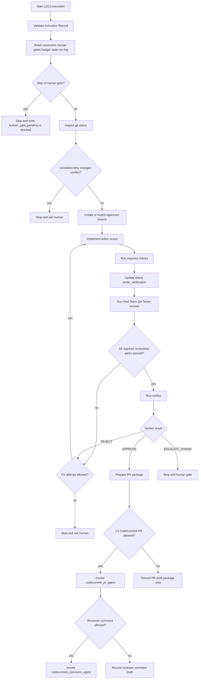

# Loop Execution Contract

このドキュメントは、L2 / L3 が許可された AI Work Ticket を実行する手順を定義する。

本PJでは最大L3まで許可済みとする。ただし L2 / L3 は scheduled run ではなく、`docs/loop-autonomy-contract.md` の Activation Record がある ticket だけ on-demand で実行できる。

## Entry Conditions

実行を開始するには、次をすべて満たす必要がある。

- 対象 ticket に L2 または L3 の Activation Record がある。
- `approved_level` が `L2` または `L3` である。
- `approval_scope` が ticket の `scope_in` / `scope_out` と矛盾しない。
- `human_gate_required = false`、または `human_gate_status = approved` である。
- `branch_name`, `base_branch`, `max_fix_attempts`, `expires_at` が明記されている。
- `loop-constraints.md`, `loop-human-gates.md`, `loop-budget.md` を読めている。
- `loop-pause-all` が有効ではない。

## Read Order

L2 / L3 実行前に必ず次を読む。

1. `LOOP.md`
2. `loop-constraints.md`
3. `loop-human-gates.md`
4. `loop-budget.md`
5. `loop-run-log.md`
6. `STATE.md`
7. `docs/loop-autonomy-contract.md`
8. `docs/loop-execution-contract.md`
9. `docs/loop-agent-registry.md`
10. `docs/loop-agent-behavior-contracts.md`
11. `docs/codecommit-pr-contract.md`
12. `docs/ai-work-ticket-contract.md`
13. `docs/ai-work-ticket-spreadsheet-schema.md`
14. 対象 AI Work Ticket row
15. 関連 Kiro spec、requirements、design、tasks
16. `.codex/skills/loop-execute/SKILL.md`
17. `.codex/agents/implementer.toml`
18. `.codex/agents/verifier.toml`

## Execution Flow



## Preflight

Orchestrator Agent は実装前に次を確認する。

- Activation Record が最新の人間指示と矛盾していない。
- Activation Record は spreadsheet 専用列に限定しない。最新の人間指示、既存の approval / handoff / triage 列、または `loop-run-log.md` に残っていればよい。
- 対象 ticket が `ready_for_implementation` または人間が実装開始を明示承認した状態である。
- `cc_sdd_required = true` または `kiro_required = true` の場合、必要な Kiro spec phase が承認済みである。
- `docs/loop-agent-registry.md` と `docs/loop-agent-behavior-contracts.md` に従い、Activation Record の `agent_plan` と `implementation_agent_type` が妥当である。
- `git status` を確認し、既存の無関係な変更を触らない。
- deny list に触れる実装ではない。
- `loop-human-gates.md` を読み、human gate 対象になった場合は実装前に停止する。

## Branch Contract

branch 作成は L2 以上かつ Activation Record がある場合だけ許可する。

Default branch name:

```text
codex/{ticket_id}-{short-slug}
```

Rules:

- `branch_name` は Activation Record に明記する。
- `base_branch` は Activation Record に明記する。
- 既存 branch を使う場合は、対象 ticket と一致していることを確認する。
- `git reset --hard`, `git checkout --`, force push、共有履歴改変は行わない。
- 既存の無関係な変更がある場合は、上書きせず停止する。

## Execution Agent Contract

L2 / L3 の実装は `.codex/skills/loop-execute/SKILL.md`, `.codex/agents/implementer.toml`, `docs/loop-agent-registry.md`, `docs/loop-agent-behavior-contracts.md` に従う。

Execution Agent の責務:

- Activation Record の `agent_plan` を検証し、primary / supporting / review agent を確認する。
- `agent_plan.execution_mode = implementation` の場合、`implementation_agent_type` が `agent_plan.primary_agent_type` と一致しているか確認する。
- `agent_plan.execution_mode = verification` または `repo_action` の場合、review / repository action agent は `agent_plan.primary_agent_type` にあり、`implementation_agent_type` に混ざっていないことを確認する。
- 選択された agent_type の振る舞いが `docs/loop-agent-behavior-contracts.md` と一致しているか確認する。
- Activation Record を検証する。
- branch 作成条件を確認する。
- 編集可能範囲と禁止範囲を確認する。
- deny list / human gate を実装前と終了前に確認する。
- 実装中止条件を満たした場合は停止する。
- required checks を実行または実行不能理由を残す。
- verifier に diff、test、risk、human gate、PR package を渡す。
- Spreadsheet の許可列だけを更新する。
- `loop-run-log.md` に execution_run を残す。

Execution Agent は `daily-triage` の代替ではない。`daily-triage` は実装 agent ではなく Loop Pattern である。

## Implementation Rules

Implementation Agent は次を守る。

- `approval_scope` と AI Work Ticket の `scope_in` だけを実装する。
- `scope_out`, `non_goals`, `explicitly_forbidden_actions` を実装しない。
- `loop-constraints.md` の deny list を越えない。
- `loop-human-gates.md` を実装前と実装後に確認する。
- `config/**` は原則編集しない。`config/routes.rb` の新規 route 追加だけ、条件を満たす場合に L2 以上で許可し得る。
- 外部 API service / connector、production、secret、credentials、infrastructure は触らない。
- unrelated refactor を行わない。
- test を green にする目的で削除、skip、弱体化しない。

実装中に scope 外作業が必要になった場合は、実装を止めて `needs_human_management` または `human_gate_pending` にする。

## Kiro And Spec Rules

次の場合は実装前に Kiro workflow を優先する。

- `cc_sdd_required = true`。
- `kiro_required = true`。
- 新機能、仕様変更、責務境界、DB、認可、外部連携、画面要件、テスト方針に影響する。
- requirements / design / tasks に分解しないと実装 agent の認識がズレる。

Kiro spec が必要なのに未承認の場合、L2 / L3 は実装しない。

## Verification Rules

実装後は次を行う。

- AI Work Ticket の `required_checks` を実行する。
- `test_plan` がある場合は従う。
- 実行できない check は、理由と残リスクを `loop-run-log.md` と spreadsheet に残す。
- `verification_result` と `verification_evidence` を更新する。
- 実装agent本人の自己判定だけで `done` に進めてはいけない。
- Red Team、QA Agent、Tester Agent、Verifier の4段階ゲートを必ず通す。
- Red Team は `adversarial_review_agent` を主担当とし、scope creep、受入条件漏れ、弱いテスト、危険な暗黙挙動、保存/ログ/security制約違反、根拠不足の完了主張を確認する。
- Red Team verdict が `APPROVE` でない場合、`done` にしてはいけない。`APPROVE_WITH_MINOR_NOTES` は Loop 完了判定では不合格とし、修正または明示的な人間判断へ戻す。
- QA Agent は `qa_agent` として、acceptance criteria と required checks の traceability、試験観点、negative case、security/storage/logging確認、not_run理由の妥当性を確認する。
- Tester Agent は `tester_agent` として、実際に試験を実行し、command、test file、ブラウザ/viewport、fixture、pass/fail/not_run、trace/screenshot有無を記録する。
- QA Agent または Tester Agent が `passed` でない場合、`done` にしてはいけない。
- Red Team、QA Agent、Tester Agent のいずれかに finding がある場合、`purple_coordination_agent` が修正、再試験、human gate、blocked のいずれかへ整理する。
- review agent が必要な agent plan の場合、各 review agent の findings を残す。
- coordination agent が必要な agent plan の場合、再実装、human escalation、Kiro 戻しの判断を残す。
- verifier agent に scope、test、risk、deny list、human gate を確認させる。
- verifier agent は test 結果だけでなく、scope creep と `loop-human-gates.md` の実装前後判定を確認する。
- verifier agent は Red Team `APPROVE`、QA Agent `passed`、Tester Agent `passed` の証跡がない場合、必ず `REJECT` する。

Verifier result:

| Result | Behavior |
|--------|----------|
| `APPROVE` | PR package 作成へ進む |
| `REJECT` | `max_fix_attempts` 内なら修正。超過したら人間へ戻す |
| `ESCALATE_HUMAN` | 即停止し human gate に送る |

## Spreadsheet Updates

L2 / L3 は、Activation Record の範囲で canonical execution fields を更新できる。

| Timing | Allowed updates |
|--------|-----------------|
| activation accepted | `approved_autonomy`, `approved_by`, `approved_at`, `approval_source`, `approval_scope`, `approval_expires_at`, `max_fix_attempts`, `human_gate_status`, `base_branch`, `branch_name`, `destination_branch`, `last_loop_run_id` |
| execution start | `status = implementation_in_progress`, `next_owner = Implementation Agent`, `branch_required`, `allowed_autonomy`, `implementation_agent_type`, `implementation_started_at`, `last_loop_run_id` |
| execution complete | `implementation_completed_at`, `commit_sha`, `verification_evidence` |
| verification start | `status = under_verification`, `next_owner = Verifier Agent`, `verification_result = not_started` |
| red team approve | `verification_evidence` または `done_evidence` に `red_team_review.verdict = APPROVE`、notes、evidence を構造化して記録 |
| qa agent pass | `verification_evidence` または `done_evidence` に `qa_agent_result.status = passed`、traceability matrix、evidence を構造化して記録 |
| tester agent pass | `verification_evidence` または `done_evidence` に `tester_agent_result.status = passed`、commands、environment、artifacts を構造化して記録 |
| verifier approve | `verification_result = passed`, `verification_evidence`, `verifier_verdict = APPROVE`, `verifier_notes`, `done_criteria_met = true` |
| verifier reject | `verification_result = failed`, `verification_evidence`, `verifier_verdict = REJECT`, `verifier_notes`, `status = ready_for_implementation` or `needs_human_management` |
| verifier escalate | `verifier_verdict = ESCALATE_HUMAN`, `verifier_notes`, `status = human_gate_pending`, `next_owner = Human` |
| human gate | `status = human_gate_pending`, `next_owner = Human`, `human_gate_status`, `human_gate_reason`, `ai_comment_summary` |
| PR approval waiting | `status = pending`, `next_owner = Human`, `pr_id`, `pr_url`, `merge_approval_status = pending`, `ai_comment_summary`, `decision_needed` |

Ticket 本体、source、scope、risk、acceptance criteria は原則更新しない。構造不足が見つかった場合は Ticket Builder / Intake に戻す。

## CodeCommit PR And Reviewer Comment Contract

詳細条件は `docs/codecommit-pr-contract.md` を正とする。

CodeCommit を使う場合、PR 作成 command と reviewer comment command は L3 だけが実行できる。実行主体は `codecommit_pr_agent` または `codecommit_comment_agent` であり、implementer / verifier は command を実行しない。L2 は PR package と reviewer comment draft を作るだけで、AWS command は実行しない。

実装完了後に CodeCommit action へ進む場合、Orchestrator Agent は `agent_plan.execution_mode` を `repo_action` にした agent plan を記録してから、`codecommit_pr_agent` または `codecommit_comment_agent` を起動する。実装用の `agent_plan` を repo action に流用しない。

L3 で PR 作成 command を実行できる条件:

- Activation Record の `approved_level = L3`。
- `allowed_actions` に `create_codecommit_pr` がある。
- `codecommit_pr_creation_allowed: true`。
- `docs/codecommit-pr-contract.md` が要求する repository name、region、AWS profile / credential 扱い、source branch、destination branch、title、description が揃っている。
- verifier が `APPROVE` している。
- human gate が `not_required` または `approved`。
- PR 作成前の人間承認が Activation Record または最新の人間指示に残っている。

PR 作成前に人間へ提示する情報:

- AI Work Ticket ID
- branch name
- base branch
- changed file summary
- test result
- verifier result
- human gate result
- PR title
- PR description
- known risk
- merge は行わないこと

CodeCommit では GitHub の draft PR と同じ概念を前提にしない。初期 PR は draft-equivalent として扱い、title または description に次を含める。

```text
Title prefix: [DRAFT]
Status: Draft
Do not merge without explicit human approval.
```

PR 作成 command は次の情報が揃ってから実行する。

```yaml
codecommit_pr_request:
  repository_name:
  region:
  source_branch:
  destination_branch:
  title:
  description:
  activation_record:
    approved_level: L3
    codecommit_pr_creation_allowed: true
```

`aws codecommit create-pull-request` 相当の command は、上記の L3 Activation Record がある場合だけ実行できる。

Reviewer comment command を実行できる条件:

- Activation Record の `approved_level = L3`。
- `allowed_actions` に `post_codecommit_reviewer_comment` がある。
- `codecommit_reviewer_comment_allowed: true`。
- 対象 PR がこの ticket の branch から作成された PR である。
- comment は verifier / reviewer の evidence に基づく。
- comment は approval、merge、close、resolve、ready 化を伴わない。

許可される reviewer comment command:

- `aws codecommit post-comment-for-pull-request` 相当。
- `aws codecommit post-comment-reply` 相当。ただし既存 comment への返信が明示許可されている場合のみ。

Reviewer comment には次を含める。

- ticket id
- verifier verdict
- scope result
- test result
- risk or human gate note
- required next action

comment には secret、credential、個人情報、production data、長いログ全文を含めない。

## Run Log Template

L2 / L3 実行時は `loop-run-log.md` に次を残す。

```yaml
execution_run:
  run_id:
  run_at:
  ticket_id:
  autonomy_level: L2 | L3
  activation:
    approved_autonomy:
    approved_by:
    approved_at:
    approval_source:
    approval_scope:
    max_fix_attempts:
    expires_at:
    human_gate_status:
    codecommit_pr_creation_allowed:
    codecommit_reviewer_comment_allowed:
    codecommit:
      repository_name:
      region:
      destination_branch:
      aws_profile_name:
  branch:
    base_branch:
    branch_name:
    created: true | false
    commit_sha:
  implementation:
    started_at:
    completed_at:
    files_changed:
    summary:
    scope_out_confirmed:
    forbidden_actions_avoided:
  human_gate:
    pre_implementation:
      required: true | false
      status: not_required | pending | approved | rejected
      reason:
    post_implementation:
      required: true | false
      status: not_required | pending | approved | rejected
      reason:
  checks:
    commands:
      - command:
        result:
        evidence:
    unable_to_run:
  verifier:
    verdict: APPROVE | REJECT | ESCALATE_HUMAN
    notes:
    evidence:
    fix_attempts_used:
  spreadsheet_updates:
    rows_updated:
      - ticket_id:
        columns:
        reason:
  pr:
    codecommit_pr_creation_allowed: true | false
    created: true | false
    pr_id:
    pr_url:
    merge_approval_status: not_requested | pending | approved | rejected | merged
    aws_command:
      command:
      result:
  reviewer_comments:
    codecommit_reviewer_comment_allowed: true | false
    posted: true | false
    comment_ids:
    drafts:
  outcome: implemented | pending_pr_approval | human_gate_pending | blocked | reverted_by_human_request
```

## Abort Conditions

次に該当する場合は即停止する。

- Activation Record がない、または期限切れ。
- `loop-pause-all` が有効。
- deny list に触れる必要がある。
- secret、credential、production data、production console に触れる必要がある。
- human gate 対象だが承認がない。
- required checks が失敗し、原因が scope 外または不明。
- verifier が `ESCALATE_HUMAN` を返した。
- `max_fix_attempts` を超えた。
- 無関係な既存変更を上書きする必要がある。
- L2 で PR 作成 command または reviewer comment command が必要になった。
- L3 で PR 作成または reviewer comment に必要な Activation Record permission がない。

## Completion Outcomes

| Outcome | Meaning | Next owner |
|---------|---------|------------|
| `implemented` | 実装、check、verifier が完了し、PR 不要または後続処理待ち | Orchestrator |
| `pending_pr_approval` | PR package は準備済みで、人間の PR 作成承認待ち | Human |
| `human_gate_pending` | human gate 判断待ち | Human |
| `blocked` | constraints、budget、missing input、test failure などで停止 | Human or Orchestrator |
| `ready_for_followup_loop` | post-merge-cleanup や pr-babysitter へ引き継ぐ signal がある | Orchestrator |
