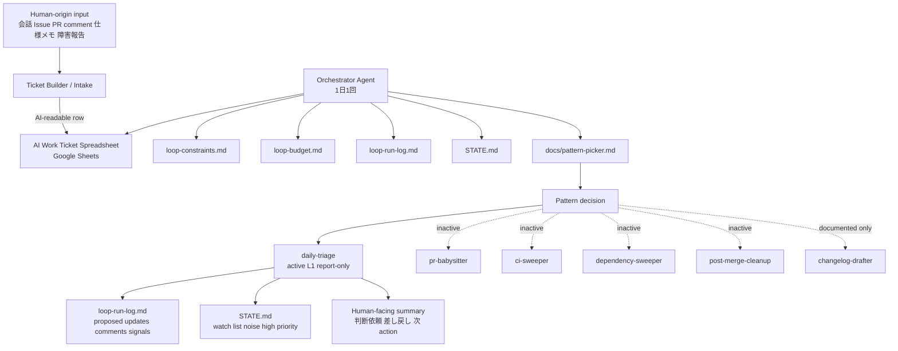
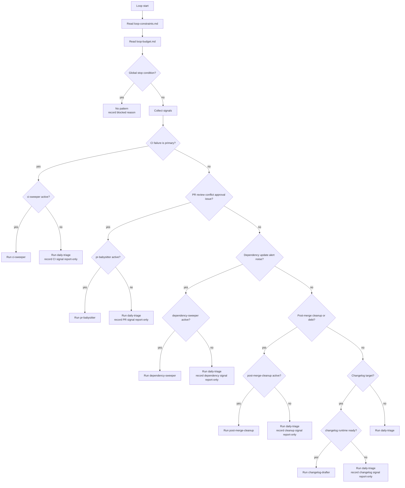
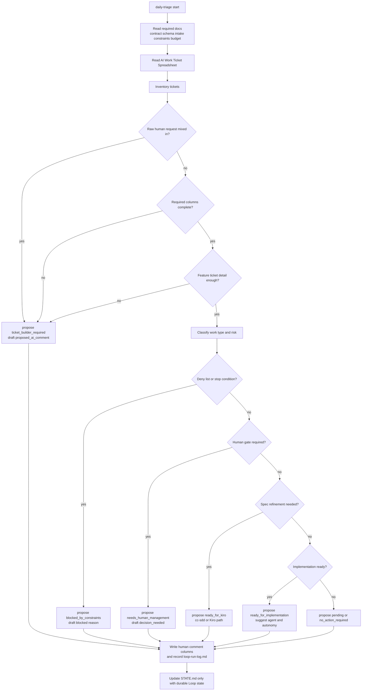
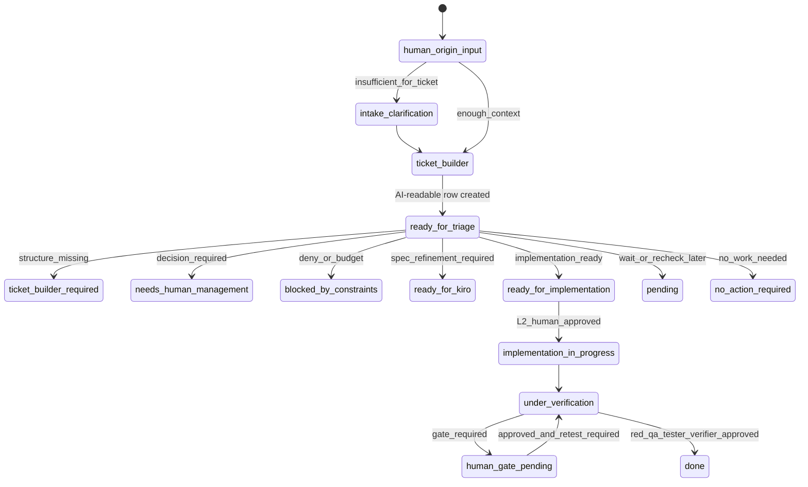
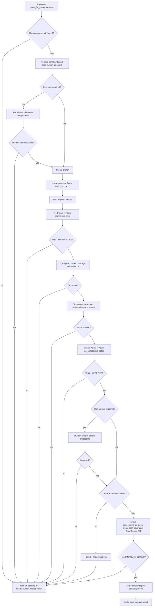
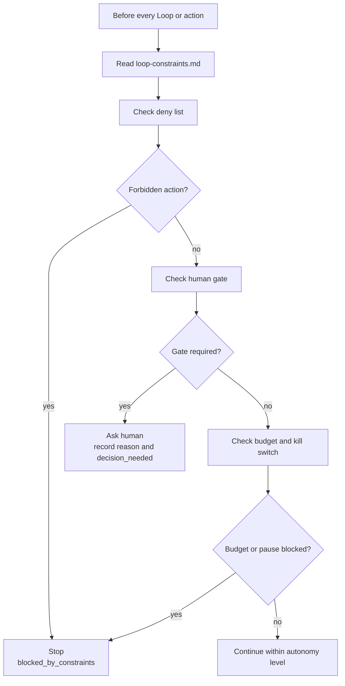

# Loop System Flow

このドキュメントは、Realtime Question Coach の Loop Engineering における全体の動き、責務境界、scheduled L1 report-only 運用、on-demand L2 / L3 実行経路をまとめる。

## Current Operating Mode

| Item | Current value |
|------|---------------|
| 実行頻度 | 1日1回 |
| 実行主体 | Orchestrator Agent |
| 最大許可自律度 | L3 |
| scheduled default | L1 report-only |
| 現在の起動 mode | report-only |
| AI Work Ticket source | Google Sheets |
| active Pattern | `daily-triage` |
| 実装 / branch / PR | 対象 ticket の Activation Record がある場合だけ on-demand で実行 |
| merge / deploy / release | 自動実行しない |
| L1 write-back | Human Communication columns と L1 Proposed Updates columns のみ許可 |
| L2 / L3 | 本PJでは許可済み。対象 ticket の Activation Record がある場合だけ有効 |

## Permission Status

本PJでは最大L3までの自律度を許可済みとする。ただし、scheduled daily-triage は L1 report-only を基本とする。

L2 / L3 に進むには、人間が対象 AI Work Ticket ごとに `docs/loop-autonomy-contract.md` の Activation Record を明示する必要がある。実行手順は `docs/loop-execution-contract.md` に従う。自動 merge、deploy、release、production 操作、secret 読み取りは行わない。

## System Overview

## Responsibility Boundary

| Component | Responsibility |
|-----------|----------------|
| Human | raw request、判断、承認、merge、production / secret / release に関わる操作の許可 |
| Ticket Builder / Intake | raw request を AI-readable な AI Work Ticket に変換する。人間向けの文章をそのまま AI 用一覧に置かない |
| AI Work Ticket Spreadsheet | AI が読む正本一覧。外部 issue や CodeCommit / PR は source / evidence として扱う |
| Orchestrator Agent | 状態、制約、予算、チケット、PR、CI、dependency、post-merge signal を読み、起動する Pattern を選ぶ |
| Pattern Picker | どの Loop Pattern を起動するかだけを決める。ticket schema、status、差し戻し文面は定義しない |
| daily-triage | AI Work Ticket の棚卸し、構造検査、human gate 判定、Kiro 要否、実装 agent 振り分け候補、status / comment 更新案を作る |
| Kiro | Loop Pattern ではない。仕様を詰める必要がある場合に daily-triage から呼ばれる spec refinement tool |
| Implementation Agent | L2 以降で、人間承認後に branch 上で実装する |
| Verifier Agent | L2 以降で、実装結果が scope、test、risk、constraints、human gate に合っているか確認する |

## Pattern Selection Flow

現時点では active Pattern は `daily-triage` のみである。そのため、他 Pattern の signal が出ても直接起動せず、`daily-triage` の L1 report-only で記録する。

## Daily Triage L1 Flow

L1 の `daily-triage` は実装しない。branch 作成、PR 作成、merge、canonical status の直接更新は行わない。出力は AI Work Ticket spreadsheet の Human Communication columns / L1 Proposed Updates columns、`loop-run-log.md` の proposed update / proposed comment、`STATE.md` に残すべき永続 state に限定する。

この図に出てくる comment は、external issue や PR に投稿するコメントではない。L1 では、AI Work Ticket spreadsheet の `ai_comment_type`, `ai_comment_summary`, `decision_needed`, `questions_for_human`, `default_assumption`, `reply_format` に人間向けコメントを書き込む。あわせて、`proposed_ai_comment`, `proposed_status`, `proposed_update_reason`, `last_loop_run_id`, `triage_notes` に提案履歴を残す。

## AI Work Ticket Lifecycle

この図は処理手順ではなく、AI Work Ticket の status 遷移候補を表す。`ready_for_triage` に入った ticket を daily-triage が確認し、条件に応じて次の status を提案する。

L1 では、この status 遷移は実際の ticket 更新ではない。`proposed_status` として記録するだけである。

この lifecycle は canonical status の候補を示す。L1 ではこれらを直接書き換えず、`proposed_status` として提示する。

## L2 And L3 On-Demand Execution Flow

本PJでは最大L3まで許可済みである。ただし L2 / L3 は scheduled run ではなく、対象 ticket の Activation Record がある場合だけ Orchestrator Agent はこの flow を実行できる。

L2 / L3 では branch 作成や実装 agent 起動を許可できる設計にする。ただし、常時許可ではなく、対象 ticket の Activation Record が必要である。許可後も、人間承認、constraints、`loop-human-gates.md`、verification を通過することが前提である。CodeCommit を使う想定のため、PR 作成は GitHub issue / PR 前提ではなく、`docs/codecommit-pr-contract.md` に定義した CodeCommit の AWS command 経路を想定する。

## Safety Gate Flow

Human gate は、DB schema、認可、{{MONEY_DOMAIN}}、{{BILLING_DOMAIN}}、{{RESERVATION_DOMAIN}}、PDF 生成結果、{{DAILY_LOCK_DOMAIN}}、KPI / management、外部連携、{{ACCOUNTING_SYSTEM}} / {{ACCOUNTING_DOMAIN}} master、infrastructure、config、production、release、deploy、merge に関係する場合に厳格に扱う。{{MONEY_DOMAIN}}や PDF はファイル単位ではなく、該当処理の意味が変わるかで判定する。

## Read And Write Boundaries

| Layer | Reads | Writes in L1 | Writes in L2+ |
|-------|-------|--------------|---------------|
| Orchestrator | constraints、budget、state、run-log、Pattern Picker、spreadsheet、signals | run-log、state | branch / ticket / PR 操作は承認後のみ |
| Ticket Builder / Intake | human-origin input、source、evidence | AI Work Ticket row draft | AI Work Ticket row 作成 / 更新 |
| daily-triage | spreadsheet、contract、schema、constraints、budget、state | Human Communication columns、L1 Proposed Updates columns、run-log、state | 承認済み範囲で ticket status 更新 |
| Pattern-specific skills | PR、CI、dependency、post-merge evidence | analysis and report only | 承認済み範囲で remediation / PR operation |
| Implementation Agent | AI Work Ticket、spec、code、constraints | none | branch 上の code change |
| Verifier Agent | diff、test result、constraints、acceptance criteria | verification report | verifier status / reviewer comment draft / `codecommit_comment_agent` handoff |

## Current Pattern Runtime Status

| Pattern | Document | Skill | State | Runtime status |
|---------|----------|-------|-------|----------------|
| `daily-triage` | yes | yes | `STATE.md` | active L1 report-only |
| `ci-sweeper` | yes | yes | yes | scaffolded inactive |
| `pr-babysitter` | yes | yes | yes | scaffolded inactive |
| `dependency-sweeper` | yes | yes | yes | scaffolded inactive |
| `post-merge-cleanup` | yes | yes | yes | scaffolded inactive |
| `changelog-drafter` | yes | no | no | documented no runtime |

## Autonomy Runtime Status

| Autonomy | Documented | Currently permitted | Notes |
|----------|------------|---------------------|-------|
| L0 | yes | yes | 人間判断のみ。Loop は実行しない |
| L1 | yes | yes | `daily-triage` report-only のみ許可 |
| L2 | yes | activation_required | 対象 ticket ごとの Activation Record がある場合だけ branch 作成、限定実装、verifier 依頼、PR package 作成を許可 |
| L3 | yes | activation_required | 対象 ticket ごとの Activation Record がある場合だけ L2 に加えて限定的な自律修正、`codecommit_pr_agent` による CodeCommit PR 作成、`codecommit_comment_agent` による reviewer comment 投稿を許可 |

## Current Next Step

First Loop manual test は `2026-07-03T17:09:39+09:00-daily-triage-l1-test` として実行済みである。

現在の次 step は、`AIT-TEST-0001` について人間が次を判断することである。

- Kiro spec 作成に進めるか
- 既存DBに FAQ 相当テーブルがあるか
- 削除方式を物理削除、論理削除、既存標準のどれに合わせるか
- 参考にすべき管理画面 CRUD はどれか

この判断があるまでは、実装、branch 作成、PR 作成、merge、canonical ticket status の直接更新は行わない。未 active Pattern signal が出た場合も、引き続き `daily-triage` の L1 report-only で記録する。
