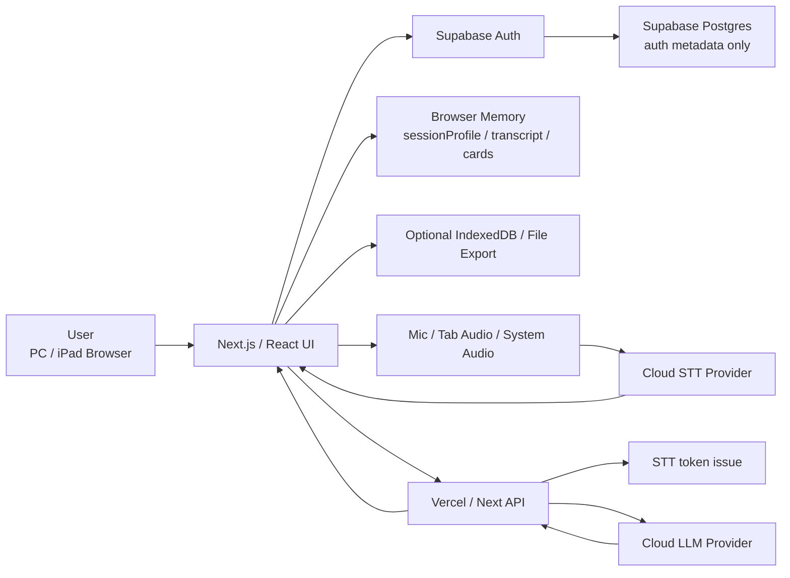

# Realtime Question Coach システム要件定義書

作成日: 2026-07-08

## 0. 作成方針

本書は、`docs/business-requirements-definition.md` と `realtime-question-coach-mvp-mock.html` を元に、Realtime Question Coach のMVPを実装するためのシステム要件を定義する。

業務要件定義書が「何を実現するか」を定義する文書であるのに対し、本書は「どの画面、どのコンポーネント、どのデータ、どのAPI、どの制約で実現するか」を定義する。

## 1. 文書の目的

本書の目的は、Realtime Question Coach のMVP実装に必要なシステム構成、画面遷移、機能コンポーネント、API、データモデル、状態管理、セキュリティ、非機能要件、受入基準を明確にすることである。

本書では「用件」ではなく、システムが満たすべき条件としての「要件」を扱う。

## 2. システム概要

Realtime Question Coach は、利用者が録音前に会話文脈を設定し、会話中に文字起こしとAI質問カードを確認するWebアプリケーションである。

主要な画面動線は次の通り。

```text
ログイン
  ↓
Session Setup
  ↓
リアルタイム文字起こし + AI補助カード
  ↓
Session Report
  ↓
破棄 / ローカル保存 / エクスポート
```

MVPでは、会話データをサーバーDBに永続保存しない。認証・権限管理に限り、Supabase Auth / Supabase Postgres 等の利用を許容する。

## 3. システム前提

| 区分 | 前提 |
| --- | --- |
| Frontend | Next.js / React |
| Hosting | Vercel |
| Auth | Supabase Auth 候補 |
| Auth DB | Supabase Postgres 候補。認証・権限メタデータのみ保存 |
| STT | Cloud STT Provider |
| AI | Cloud LLM Provider |
| 会話データ保存 | サーバーDBには保存しない |
| 音声保存 | 自社クラウドには保存しない |
| クライアント保存 | Browser memory を基本。ユーザー明示時のみ IndexedDB / File export |
| 通信 | HTTPS / WSS / TLS の暗号化通信のみ |

## 4. スコープ

### 4.1 MVP対象

- ログイン
- 最小限の権限管理
- Session Setup
- `sessionProfile` 生成
- プレイブック選択
- 音声入力ソース選択
- マイク音声取得
- ブラウザ/OSが許可する場合のWebタブ音声またはシステム音声取得
- Cloud STT 連携
- partial / final transcript 表示
- local rule gate
- LLMカード生成
- AIカードJSON schema検証
- active最大3件のカード表示制御
- queued / later / dismissed / done / pinned のカード状態管理
- 会議後レポート
- ローカル保存 / Markdown / JSON エクスポート

### 4.2 MVP非対象

- 会話本文のサーバーDB保存
- 音声ファイルの自社クラウド保存
- 社内資料検索 / RAG
- CRM / Notion / Slack / Google Drive 連携
- 複数端末同期
- 高度なチーム管理
- 管理者監査
- 課金
- デスクトップアプリ
- ローカルSTT
- ローカルLLM
- AIによる音声発話

## 5. 全体アーキテクチャ



### 5.1 Vercel / Next APIの責務

- STT短命トークンを発行する。
- LLM APIキーをブラウザへ出さずに保持する。
- LLM呼び出しをプロキシする。
- LLM入出力をJSON schemaで検証する。
- レート制限を行う。
- 会話本文、音声、LLM入力、LLM応答をログ出力しない。

### 5.2 Vercel / Next APIで行わないこと

- 長時間音声ストリームの中継
- 音声ファイル保存
- 文字起こし全文の永続保存
- 会話本文のログ出力
- AIカード本文のDB保存

## 6. 画面要件

### 6.1 ログイン画面

| ID | 要件 |
| --- | --- |
| UI-001 | 利用者はログインしてアプリを利用できる。 |
| UI-002 | MVPでは `owner` / `user` 程度の最小ロールを扱う。 |
| UI-003 | ログイン後、Session Setupへ遷移する。 |
| UI-004 | 認証・権限情報以外の会話データをAuth DBへ保存しない。 |

### 6.2 Session Setup画面

Session Setup は、会議開始前に表示する専用画面である。文字起こし画面と同時表示しない。

| ID | 要件 |
| --- | --- |
| UI-005 | 初期画面として Session Setup を表示する。 |
| UI-006 | 会話タイプを選択できる。初期候補は商談、要件定義、採用、ユーザー調査とする。 |
| UI-007 | 業界、相手役職、今回の目的、必ず確認する論点を入力できる。 |
| UI-008 | 音声ソースを選択できる。候補はマイク、Webタブ音声、システム音声とする。 |
| UI-009 | 選択した音声ソースについて、ブラウザの明示的な許可操作を要求する。 |
| UI-010 | 通信・保存方針を確認できる。HTTPS/WSS、会話DBなし、本文ログなしを表示する。 |
| UI-011 | `セッション開始` 操作により、文字起こし + AI補助カード画面へ遷移する。 |

### 6.3 リアルタイムセッション画面

リアルタイムセッション画面は、左に文字起こし、右にAI補助カードを表示する。

| ID | 要件 |
| --- | --- |
| UI-012 | 左ペインにリアルタイム文字起こしを表示する。 |
| UI-013 | 右ペインにAI補助カードを表示する。 |
| UI-014 | activeカード数、queuedカード数、doneカード数を表示する。 |
| UI-015 | `再判定` 操作で現在の文脈からカード候補を再評価できる。 |
| UI-016 | `設定へ戻る` 操作でSession Setupへ戻れる。 |
| UI-017 | `終了` 操作でSession Reportを表示する。 |

### 6.4 Session Report画面

| ID | 要件 |
| --- | --- |
| UI-018 | 会議終了時に聞けたこと、聞けなかったこと、次回確認事項を表示する。 |
| UI-019 | 保存しない場合はブラウザメモリ上のセッションデータを破棄する。 |
| UI-020 | ユーザー明示操作により、Markdown / JSON でエクスポートできる。 |
| UI-021 | ユーザー明示操作により、ローカル保存できる。 |

## 7. 機能コンポーネント要件

| コンポーネント | 責務 |
| --- | --- |
| Auth Manager | Supabase Auth連携、セッション確認、ロール取得 |
| Session Setup Manager | 入力値管理、`sessionProfile` 生成、プレイブック選択 |
| Audio Source Manager | マイク、Webタブ音声、システム音声の選択と権限取得 |
| STT Client | Cloud STTとのストリーミング接続、partial/final受信 |
| Transcript Store | transcript segmentをブラウザメモリに保持 |
| Conversation Buffer | AI判定用に直近1-3分のfinal transcriptを保持 |
| Playbook Resolver | `sessionProfile` に対応するプレイブックを選択 |
| Local Rule Gate | LLMを呼ぶべきかをローカル判定 |
| LLM Proxy Client | `/api/coach`, `/api/report` を呼び出す |
| Coach Card Engine | カード重複判定、スコアリング、active/queued状態管理 |
| Report Builder | 聞けたこと、聞けなかったこと、次回確認事項を生成 |
| Export Manager | Markdown / JSON export、任意のIndexedDB保存 |

## 8. 認証・権限要件

### 8.1 認証方式

| ID | 要件 |
| --- | --- |
| AUTH-SYS-001 | Supabase Auth を認証基盤候補とする。 |
| AUTH-SYS-002 | 認証状態はフロントエンドとNext APIで検証する。 |
| AUTH-SYS-003 | API呼び出し時は認証済みユーザーのみ許可する。 |
| AUTH-SYS-004 | API routeではユーザーIDとロールを検証する。 |

### 8.2 権限モデル

| Role | 権限 |
| --- | --- |
| `owner` | 自分のセッション開始、カード生成、レポート生成、エクスポート、設定変更 |
| `user` | 自分のセッション開始、カード生成、レポート生成、エクスポート |

MVPは個人利用前提のため、組織管理、管理者監査、複数人共有は扱わない。ただし将来拡張に備え、Authメタデータ上はロールを保持する。

### 8.3 Auth DB保存対象

保存してよいもの:

- userId
- email
- auth provider
- role
- createdAt
- updatedAt
- user preferenceの最小項目

保存してはいけないもの:

- 音声ファイル
- 文字起こし本文
- AIカード本文
- LLM入力
- LLM応答
- 会議後レポート本文

## 9. 音声入力・STT要件

### 9.1 音声ソース

| ソース | 取得方式 | 備考 |
| --- | --- | --- |
| マイク | `getUserMedia` | MVPの基本入力 |
| Webタブ音声 | `getDisplayMedia` 等のブラウザ対応機能 | 対応可否はブラウザ仕様に従う |
| システム音声 | OS/ブラウザ対応範囲 | 非対応環境では選択不可または警告 |

すべての音声ソース取得は、ブラウザの明示的な権限許可を必要とする。

### 9.2 STT連携

| ID | 要件 |
| --- | --- |
| STT-001 | ブラウザはVercel APIからSTT短命トークンを取得する。 |
| STT-002 | ブラウザはCloud STT Providerへ直接ストリーミング接続する。 |
| STT-003 | Vercel / Next APIは長時間音声ストリームを中継しない。 |
| STT-004 | `partial transcript` は画面表示用とする。 |
| STT-005 | `final transcript` は会話バッファとAI判定対象にする。 |
| STT-006 | 音声ファイルを自社クラウドに保存しない。 |

## 10. AIカード生成要件

### 10.1 local rule gate

local rule gate は、LLM呼び出し前にブラウザ側で実行する軽量判定である。

LLMを呼ぶ条件:

- final transcript が追加された。
- 重要語が出た。
- 曖昧表現が出た。
- `mustCheck` の未確認項目に関連する発話が出た。
- 話題が切り替わった。
- 同じ論点が繰り返された。
- ユーザーが `再判定` を押した。

LLMを呼ばない条件:

- partial transcriptのみ。
- 相槌。
- 雑談。
- 短すぎる発話。
- 既に処理済みの論点。
- クールダウン中で重要度が閾値未満。

### 10.2 LLM呼び出し頻度

| 条件 | ルール |
| --- | --- |
| 通常 | 15-30秒に1回以下 |
| 高重要度 | 10秒程度のクールダウン後に許可 |
| 手動再判定 | 即時。ただし短時間連打はレート制限 |

### 10.3 LLM入力

LLMには会話全文を送らない。送信対象は次に絞る。

- 直近1-3分のfinal transcript
- `sessionProfile`
- 使用中のplaybook要約
- 既に聞けた項目
- 未確認項目
- 既出カードの `dedupeKey`
- active / queued / done / dismissed / later のカード状態

### 10.4 Coach Card JSON

```json
{
  "shouldShow": true,
  "priority": "now",
  "title": "役員会で誰が最終判断するか確認",
  "question": "役員会では、どなたが最終判断される想定ですか？",
  "reason": "予算と役員会の話が出たが、最終決裁者が未確認",
  "urgency": 28,
  "impact": 24,
  "confidence": 8,
  "topicFreshness": 8,
  "mustCheckGap": 18,
  "dedupeKey": "decision-maker"
}
```

必須項目:

- `shouldShow`
- `priority`
- `title`
- `question`
- `reason`
- `urgency`
- `impact`
- `confidence`
- `topicFreshness`
- `mustCheckGap`
- `dedupeKey`

### 10.5 カード表示制御

| 状態 | 意味 |
| --- | --- |
| `active` | 右ペインに表示中。最大3件 |
| `queued` | 表示待ち |
| `later` | あとで回収 |
| `done` | 聞いた / 回収済み |
| `dismissed` | 不要として抑制 |
| `pinned` | 固定。自動降格しない |

表示ルール:

1. activeカードは最大3件にする。
2. 新規候補はスコアリングと `dedupeKey` による重複判定を通す。
3. active枠が空いている場合は高スコア順に表示する。
4. active枠が満杯の場合、新規候補がactive内の最低スコアを上回る時だけ入れ替える。
5. 入れ替えられたカードは破棄せず、`queued` または `later` に移す。
6. `pinned` は原則として自動降格しない。
7. `done` / `dismissed` は同一論点の再表示を抑制する。
8. `再判定` では active / queued / later を再スコアリングする。

## 11. データモデル要件

### 11.1 `sessionProfile`

```json
{
  "meetingType": "sales",
  "industry": "manufacturing",
  "counterpartRole": "operations_manager",
  "phase": "discovery",
  "goal": "identify_pain_points",
  "productCategory": "workflow_automation",
  "mustCheck": ["budget", "decision_maker", "current_process", "timeline", "permissions"],
  "avoid": ["pricing_commitment_without_scope"]
}
```

### 11.2 `transcriptSegment`

```json
{
  "id": "seg_001",
  "sessionId": "local_session_001",
  "speaker": "counterpart",
  "kind": "final",
  "text": "来月の役員会で予算が通るかどうかが決まります。",
  "startedAtMs": 68000,
  "endedAtMs": 76000,
  "createdAt": "2026-07-08T10:00:00.000Z"
}
```

### 11.3 `conversationState`

```json
{
  "sessionId": "local_session_001",
  "heard": ["current_process"],
  "missing": ["budget", "decision_maker", "timeline"],
  "recentTopics": ["budget", "board_meeting", "estimate"],
  "activeCardIds": ["card_001", "card_002", "card_003"],
  "queuedCardIds": ["card_004"]
}
```

### 11.4 `coachCard`

```json
{
  "id": "card_001",
  "dedupeKey": "decision-maker",
  "state": "active",
  "priority": "now",
  "title": "役員会で誰が最終判断するか確認",
  "question": "役員会では、どなたが最終判断される想定ですか？",
  "reason": "予算と役員会の話が出たが、最終決裁者が未確認",
  "score": 91,
  "pinned": false,
  "createdAtMs": 76000,
  "updatedAtMs": 76000
}
```

### 11.5 `sessionReport`

```json
{
  "heard": ["初期対象は請求関連の問い合わせ", "閲覧権限と更新権限を分けたい"],
  "missed": ["役員会での最終決裁者", "概算に必要な対象件数"],
  "nextActions": ["予算枠と承認フローを確認", "トライアル成功条件を確認"]
}
```

## 12. API要件

### 12.1 API一覧

| API | Method | 目的 | 保存方針 |
| --- | --- | --- | --- |
| `/api/session/init` | POST | 一時sessionId生成、初期設定検証 | DB保存しない |
| `/api/stt-token` | POST | STT短命トークン発行 | DB保存しない |
| `/api/coach` | POST | AIカード生成 | 入出力本文をログ保存しない |
| `/api/report` | POST | 会議後レポート生成 | 入出力本文をログ保存しない |

Supabase Authのログイン処理は、Supabase SDKまたはAuthヘルパーで扱う。独自APIでパスワードを受け取らない。

### 12.2 `/api/session/init`

Request:

```json
{
  "sessionProfile": {},
  "audioSource": "mic",
  "retentionMode": "no_store"
}
```

Response:

```json
{
  "sessionId": "local_session_001",
  "retentionMode": "no_store",
  "accepted": true
}
```

### 12.3 `/api/stt-token`

Request:

```json
{
  "sessionId": "local_session_001",
  "audioSource": "mic",
  "language": "ja-JP"
}
```

Response:

```json
{
  "endpoint": "wss://stt-provider.example/stream",
  "token": "ephemeral-token",
  "expiresInSec": 300
}
```

### 12.4 `/api/coach`

Request:

```json
{
  "sessionId": "local_session_001",
  "sessionProfile": {},
  "playbook": {},
  "recentFinalTranscript": [],
  "conversationState": {},
  "activeCards": [],
  "queuedCards": []
}
```

Response:

```json
{
  "cards": [],
  "model": "realtime",
  "validated": true
}
```

### 12.5 `/api/report`

Request:

```json
{
  "sessionId": "local_session_001",
  "finalTranscriptExcerpt": [],
  "cardStates": [],
  "sessionProfile": {}
}
```

Response:

```json
{
  "heard": [],
  "missed": [],
  "nextActions": [],
  "validated": true
}
```

## 13. 保存・保持要件

| データ | 保存場所 | 保持期間 |
| --- | --- | --- |
| 認証ユーザー | Supabase Auth / Supabase Postgres | アカウントが存在する間 |
| 権限ロール | Supabase Postgres | アカウントが存在する間 |
| `sessionProfile` | Browser memory | セッション中 |
| transcript | Browser memory | セッション中 |
| conversation buffer | Browser memory | セッション中 |
| coach cards | Browser memory | セッション中 |
| session report | Browser memory | セッション中 |
| ローカル保存データ | IndexedDB | ユーザーが削除するまで |
| エクスポートファイル | ユーザー端末 | ユーザー管理 |

サーバーDBへ保存しないもの:

- 音声
- transcript本文
- AIカード本文
- LLM入力
- LLM応答
- session report本文

## 14. セキュリティ要件

| ID | 要件 |
| --- | --- |
| SEC-001 | Browser -> Vercel / Next API はHTTPSのみ許可する。 |
| SEC-002 | Browser -> Cloud STT はHTTPS / WSS 等の暗号化通信のみ許可する。 |
| SEC-003 | Vercel / Next API -> Cloud LLM はHTTPSのみ許可する。 |
| SEC-004 | Browser / API -> Auth基盤 はHTTPSのみ許可する。 |
| SEC-005 | 平文HTTPによる音声、文字起こし、LLM入力、LLM応答、認証情報の送信を禁止する。 |
| SEC-006 | APIキーはブラウザへ出さない。 |
| SEC-007 | Vercelログに会話本文、音声、LLM入力、LLM応答を出力しない。 |
| SEC-008 | STT/LLMプロバイダの no-training / low-retention / no-store 設定を確認する。 |
| SEC-009 | Supabase Postgresを使う場合はRLSを有効化する。 |
| SEC-010 | 認証DBに会話本文、音声、AIカード、レポート本文を保存しない。 |

## 15. 非機能要件

### 15.1 パフォーマンス

| ID | 要件 |
| --- | --- |
| NFR-SYS-001 | 重要論点発生から初回カード表示まで10秒以内を目標にする。 |
| NFR-SYS-002 | LLM呼び出し頻度は通常15-30秒に1回以下を目標にする。 |
| NFR-SYS-003 | activeカード表示は最大3件とする。 |
| NFR-SYS-004 | partial transcriptではLLMを呼ばない。 |
| NFR-SYS-005 | LLM入力は直近1-3分の会話に制限する。 |

### 15.2 対応環境

| ID | 要件 |
| --- | --- |
| NFR-SYS-006 | PCブラウザで利用できる。 |
| NFR-SYS-007 | iPadブラウザで利用できる。 |
| NFR-SYS-008 | マイク取得、Webタブ音声、システム音声の対応可否をブラウザごとに確認する。 |
| NFR-SYS-009 | Webタブ音声またはシステム音声が非対応の場合、マイク入力へフォールバックできる。 |

### 15.3 可用性・障害時

| ID | 要件 |
| --- | --- |
| NFR-SYS-010 | STT接続に失敗しても画面全体は停止しない。 |
| NFR-SYS-011 | LLM呼び出しに失敗しても文字起こし表示は継続する。 |
| NFR-SYS-012 | Authセッション切れ時はSession Setupまたはログインへ戻す。 |
| NFR-SYS-013 | ネットワーク不調時は、保存されていない会話データの扱いをUIで明示する。 |

## 16. 環境変数

| Name | 用途 |
| --- | --- |
| `SUPABASE_URL` | Supabase project URL |
| `SUPABASE_ANON_KEY` | Browser用Supabase anon key |
| `SUPABASE_SERVICE_ROLE_KEY` | Server-side管理操作用。ブラウザへ出さない |
| `STT_API_KEY` | STT Provider API key |
| `STT_REGION` | STT Provider region |
| `RQC_LLM_PROVIDER` | `mock`, `openai`, `anthropic` のいずれか |
| `OPENAI_API_KEY` | OpenAI adapter用server-only key。ブラウザへ出さない |
| `ANTHROPIC_API_KEY` | Anthropic Claude adapter用server-only key。ブラウザへ出さない |
| `LLM_MODEL_REALTIME` | リアルタイムカード生成用モデル |
| `LLM_MODEL_REPORT` | 会議後レポート用モデル |
| `RETENTION_MODE` | `no_store` を基本値とする |

## 17. ログ要件

ログに出してよいもの:

- requestId
- userId hash
- sessionId hash
- API名
- status code
- latency
- token count
- card count
- error code

ログに出してはいけないもの:

- 音声
- 文字起こし本文
- LLM入力本文
- LLM応答本文
- AIカード本文
- 会議後レポート本文
- API key
- STT短命トークン

## 18. 受入基準

### 18.1 最初の実装単位

- ログインできる。
- Session Setupが初期画面として表示される。
- Session Setupで会話タイプ、業界、相手役職、目的、確認論点、音声ソースを設定できる。
- `セッション開始` で文字起こし + AI補助カード画面へ遷移する。
- ダミー文字起こしからAIカードを生成できる。
- activeカードは最大3件に制限される。
- 重要度の高い新規カードが来た場合、低優先カードがqueuedへ移動する。
- `聞いた` / `あとで` / `不要` / `固定` / `再判定` が動作する。
- `設定へ戻る` でSession Setupへ戻れる。

### 18.2 MVP全体

- Supabase Auth等で認証できる。
- 最小限の権限ロールを扱える。
- 認証DBに会話本文、音声、AIカード、レポート本文が保存されない。
- マイク権限を取得できる。
- ブラウザ/OSが許可する場合、Webタブ音声またはシステム音声を選択できる。
- STT短命トークンを発行できる。
- ブラウザからCloud STTへ直接ストリーミングできる。
- partial transcriptを暫定表示できる。
- final transcriptを会話バッファへ追加できる。
- local rule gateで不要なLLM呼び出しを抑制できる。
- `/api/coach` の入出力をJSON schema検証できる。
- `/api/report` で会議後レポートを生成できる。
- 通信経路がHTTPS / WSS / TLSで暗号化されている。
- Vercelログに本文、音声、LLM入力、LLM応答が出ない。
- ユーザー明示操作でローカル保存またはMarkdown/JSONエクスポートできる。

## 19. 未決事項

- Supabase Auth / Supabase Postgres を正式採用するか。
- STT Providerをどれにするか。
- LLM Providerとモデルをどれにするか。
- Webタブ音声 / システム音声の対応ブラウザ範囲。
- STT/LLMプロバイダの no-training / retention / no-store 設定。
- 個人情報・固有名詞マスキングをMVPでONにするか。
- local rule gate のスコア閾値。
- activeカード入れ替えスコアの正式計算式。
- `sessionProfile`, `playbook`, `coachCard`, `sessionReport` の正式JSON schema。
- IndexedDB保存をMVPに含めるか、exportのみとするか。

## 20. 参考資料

- `docs/business-requirements-definition.md`
- `realtime-question-coach-mvp-mock.html`
- `Project.md`
- `ProjectGoal.md`
- `AI_BOOTSTRAP_CONTEXT.md`
- `cloud-stt-ai-system-flows.md`
