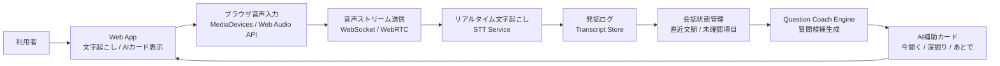
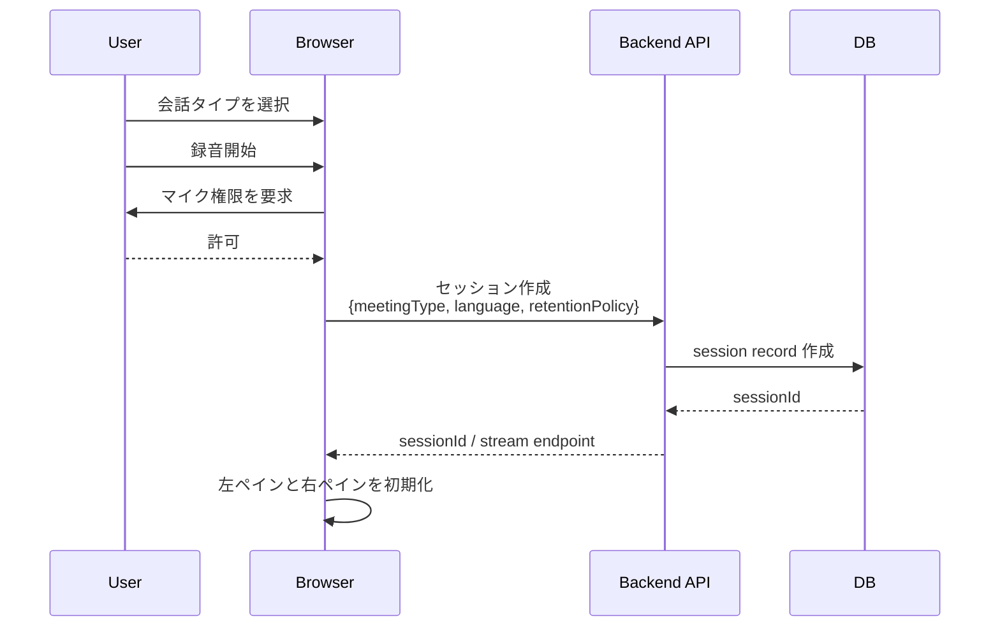
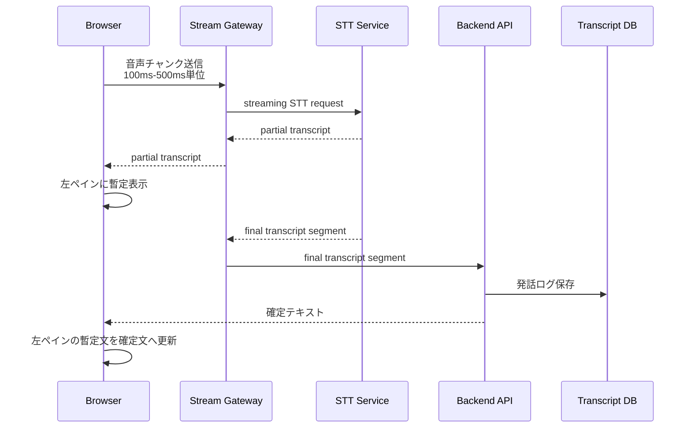
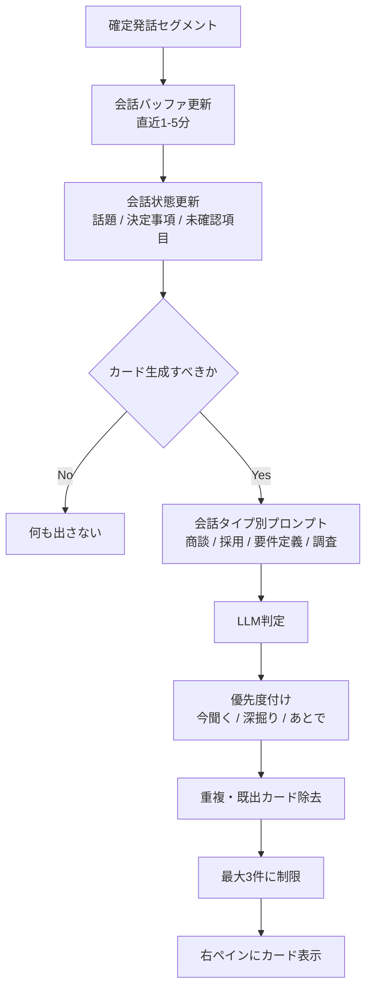
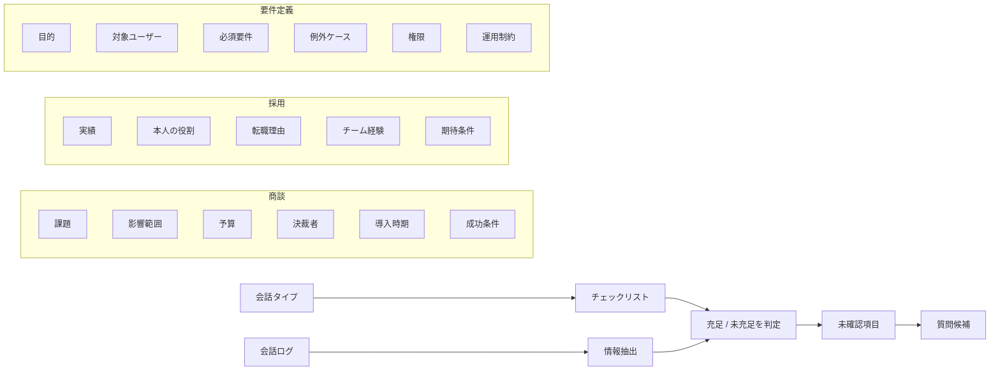
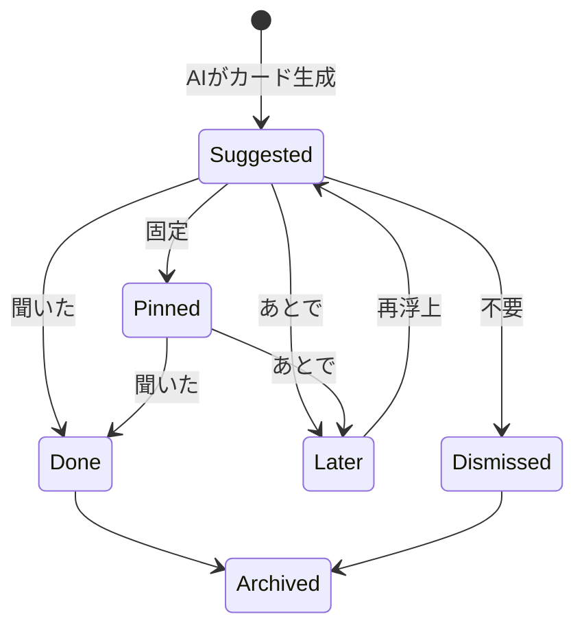
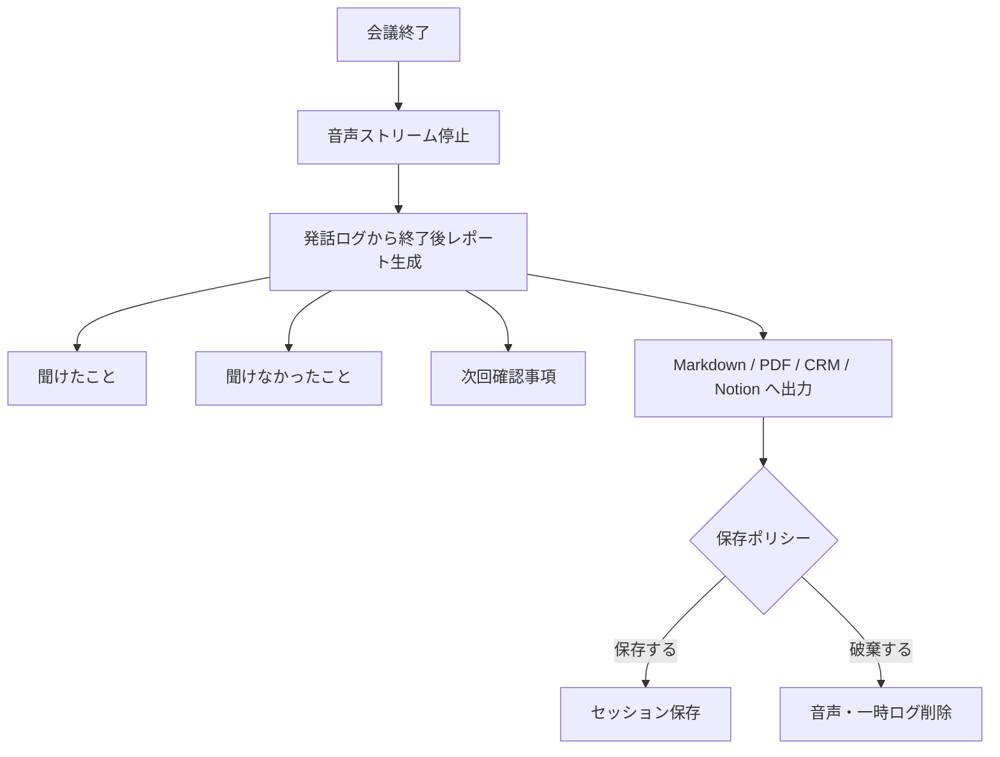
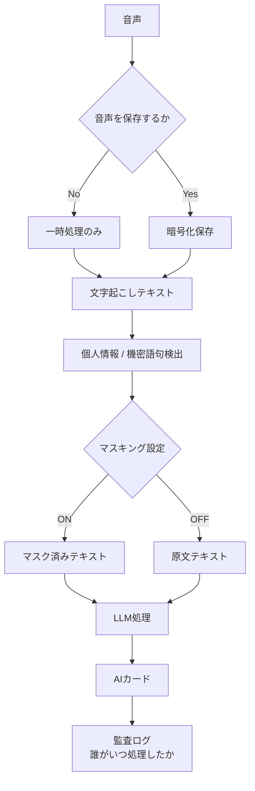
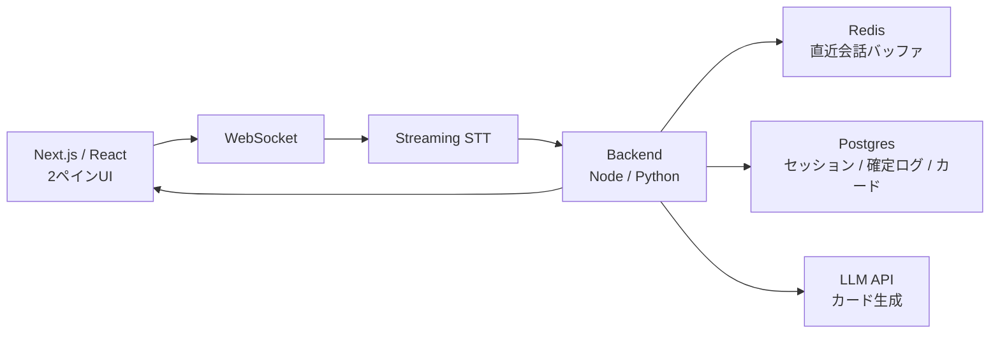
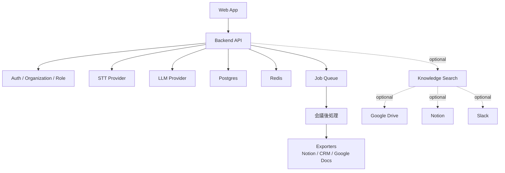

# Realtime Question Coach: Web System Flows

## 1. 全体像

Web版では、ブラウザ側は「録音・表示・軽い状態管理」に寄せ、サーバー側で「文字起こし・会話状態の更新・AIカード生成」を担う構成が扱いやすい。

## 2. セッション開始フロー

初回は、録音同意・保存期間・会話タイプを明示する。特に商談や面接では、録音・文字起こしの社内ルールに乗せる必要がある。

## 3. リアルタイム文字起こしフロー

ポイントは、`partial` と `final` を分けること。AIカード生成には原則 `final transcript` を使う。暫定文字起こしをそのままLLMに渡すと、誤変換でノイズが増える。

## 4. AI補助カード生成フロー

ここで重要なのは、毎回カードを出さないこと。`Gate` で「新しい重要論点が出た」「未確認のまま会話が進みそう」「期限・金額・権限・責任者などが出た」場合だけ生成する。

## 5. 会話タイプ別のチェックリスト照合

LLMに自由に考えさせるより、会話タイプごとの型を持たせる。これにより出力が安定し、プロダクトとしての品質を制御しやすくなる。

## 6. カード操作フロー

ユーザー操作は学習データとして使える。たとえば「不要」が多いカードタイプは抑制し、「固定」「聞いた」が多いカードタイプは優先度を上げる。

## 7. 会議後フロー

リアルタイム要約を主機能にしなくても、終了後に「聞けた / 聞けなかった / 次回確認」を出すと価値が残る。

## 8. セキュリティ・プライバシーフロー

企業向けなら最低限必要になる論点:

- 録音同意をどう取るか
- 音声を保存するか、一時処理だけにするか
- 文字起こしテキストの保存期間
- LLMに送る前のマスキング
- ユーザーごとのアクセス制御
- 監査ログ
- モデル学習への利用禁止設定

## 9. 推奨MVP構成

MVPでは社内資料検索やRAGは入れない。まずは「会話タイプ別チェックリスト」と「直近会話」だけで質問候補を出す。

## 10. 本番構成の拡張

社内資料連携は後からでよい。入れる場合も、最初は「会議後の確認」に寄せた方が安全。リアルタイム中に社内資料を引くと、権限・遅延・誤提示の難易度が一段上がる。

## 11. 最小実装の処理順

1. ユーザーが会話タイプを選ぶ
2. ブラウザでマイク許可を取る
3. 音声をサーバーへストリーミングする
4. STTで文字起こしする
5. 左ペインに `partial`、確定後に `final` を表示する
6. 確定発話をRedisの会話バッファに入れる
7. 数十秒ごと、または重要語検出時にAI判定を走らせる
8. チェックリストと会話状態から質問候補を生成する
9. 重複を除き、最大3件を右ペインに出す
10. ユーザー操作を保存する
11. 会議終了後に聞けたこと・聞けなかったことを出す

